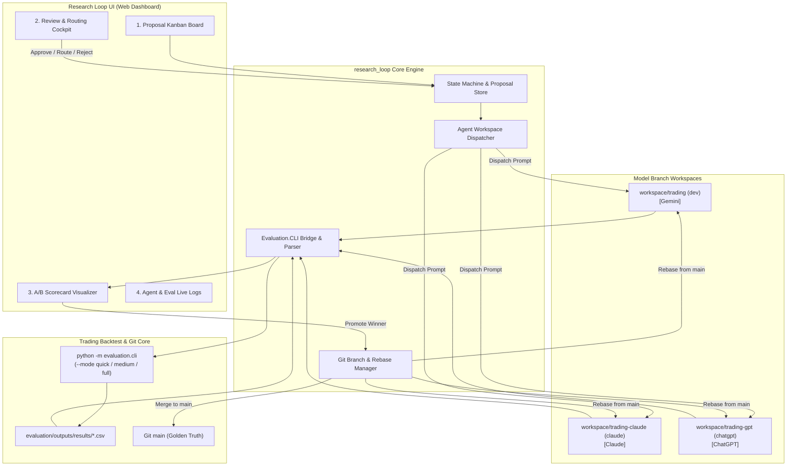
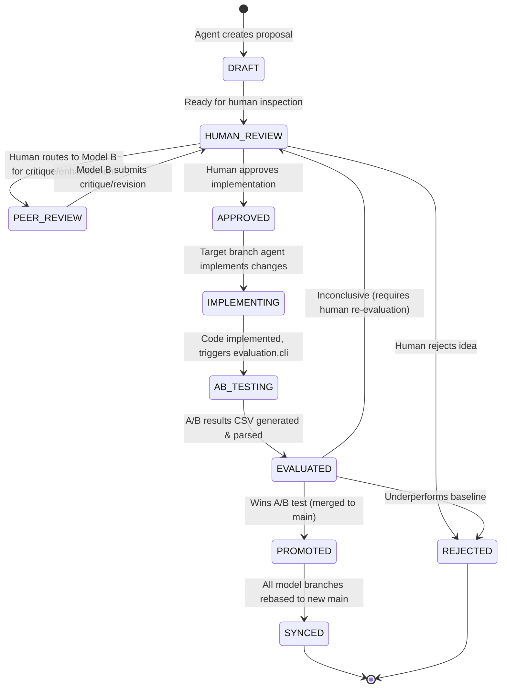
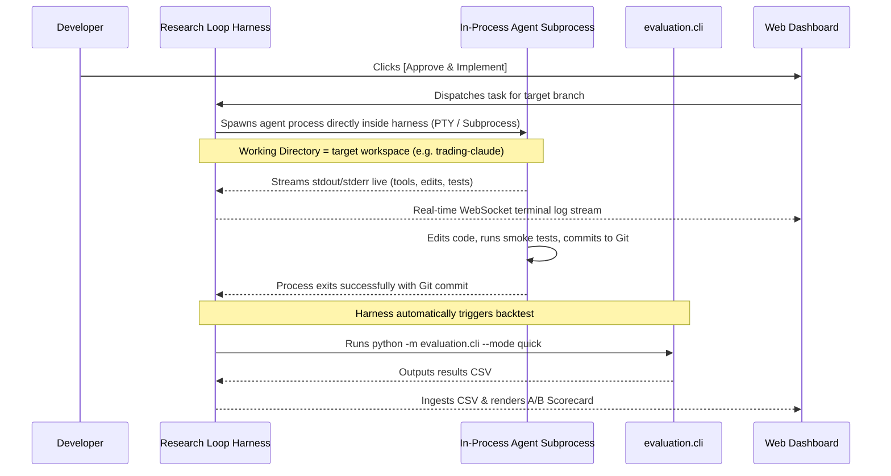
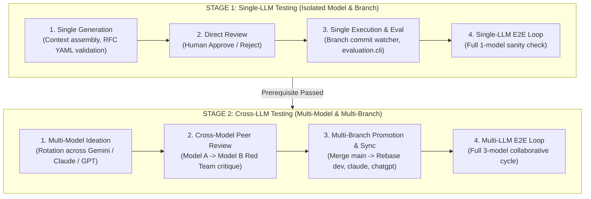

# Design Document: Multi-Model ML Trading Research Harness Loop

## 1. Executive Summary

This document describes the architecture, workflow state machine, agent dispatching mechanism, and user interface for the **Autonomous ML Trading Research Loop (`research_loop`)**. 

The goal of this system is to orchestrate continuous algorithmic discovery, peer review, human governance, and empirical A/B backtesting across three frontier LLMs operating on dedicated Git branches:
- **`workspace/trading`** (`dev` branch) — Managed by **Gemini** (Antigravity)
- **`workspace/trading-claude`** (`claude` branch) — Managed by **Claude Code**
- **`workspace/trading-gpt`** (`chatgpt` branch) — Managed by **ChatGPT**
- **Golden Truth Reference**: The **`main`** branch of the trading repository.
- **Verification Engine**: The existing, battle-tested `python -m evaluation.cli` walk-forward evaluation harness (featuring 14-day embargo, regime stratification across Bull/Bear $\times$ Hi/Lo vol, and standardized primary metric scorecards).

---

## 2. System Architecture



---

## 3. The Proposal Lifecycle (State Machine)

Every algorithmic idea is tracked as an individual, git-versioned file in `research_loop/proposals/` (e.g., `PROP-001.md`).



### 3.1. Proposal Ideation Engine (How Proposals are Generated)

Proposals do not require writing markdown files by hand. The harness generates them from Gemini, Claude, or ChatGPT using a **Grounded Ideation Engine**.

#### 1. How You Trigger Proposal Generation:
- **Method A: One-Click UI Generation (Primary)**:
  In the Web UI, you click **`[ ＋ Generate Proposal ]`**. A simple modal lets you select:
  1. **Author Model**: `Gemini` | `Claude Code` | `ChatGPT`
  2. **Target Strategy**: `standalone_tb` | `quantile` | `stacked_tb` | `hybrid` | `auto-detect`
  3. **Research Theme / Directive**:
     - *Feature Engineering*: (e.g. volatility estimators, macro regime indicators, volume signals)
     - *Risk & Guardrails*: (e.g. dynamic deleveraging, stop-loss/profit-target optimization, time-in-trade hazard)
     - *Hyperparameter & Model Tuning*: (e.g. tree depth, colsample, seed bagging, objective functions)
     - *Regime Bottleneck Fix*: (e.g. "Focus on reducing drawdowns in Bear-Hi folds")
     - *Open Exploration*: Let the model inspect recent performance and formulate its own hypothesis.
  - The harness calls the selected model with the **Ideation Context Packet**, generates `proposals/active/PROP-###.md`, and places the card directly into **`HUMAN_REVIEW`** on the Kanban board.

- **Method B: Continuous Autonomous Ideation (Self-Driving Loop)**:
  - When enabled, the harness triggers the next model in rotation whenever an A/B test finishes.
  - The model inspects the latest backtest results (specifically analyzing the worst-performing folds) and drafts the next logical improvement for your review.

- **Method C: In-Chat Ideation**:
  - During your normal conversations with Claude Code, Gemini (Antigravity), or ChatGPT, you can simply ask:
    *"Propose an algorithmic improvement for the quantile ranker based on our recent baseline."*
  - The model writes the RFC file to `research_loop/proposals/active/PROP-###.md`.

#### 2. The Ideation Context Packet (Preventing Hallucination):
To ensure proposals are mathematically sound and immediately executable, the harness automatically injects:
1. **Codebase Topology**: Summary of `RunConfig`, strategy entry points, and existing features in `features.py`.
2. **Current Baseline Metrics**: The latest benchmark scores from `evaluation/outputs/results/`.
3. **Negative Knowledge Base**: Summary of past rejected proposals from `proposals/rejected/` so the model avoids re-testing failed ideas.
4. **RFC Output Contract**: Instructions to output the exact YAML frontmatter (hypothesis, target files, acceptance criteria).

   - **Action 1: Approve** $\to$ transitions to `APPROVED` and triggers implementation.
   - **Action 2: Route to Model B** $\to$ transitions to `PEER_REVIEW` with an assignment (e.g. "Review for look-ahead bias" or "Refine the hyperparameter schedule").
   - **Action 3: Reject** $\to$ transitions to `REJECTED` with an optional rationale.
3. **PEER_REVIEW**: The designated model (Gemini, Claude, or ChatGPT) inspects the proposal, appends its critique/enhancements, and returns it to `HUMAN_REVIEW`.
4. **IMPLEMENTING**: The assigned branch agent writes the actual code modifications in its workspace.
5. **AB_TESTING**: The harness runs `python -m evaluation.cli --strategy <strat> --mode <quick|medium|full> --ab <variant>` in the workspace.
6. **EVALUATED**: The results CSV is automatically ingested into the UI, displaying:
   - Primary Metrics: Top-1 Precision@10%, Total PnL, Trade Win Rate.
   - Guardrails: Worst-fold PnL, Max Drawdown, Ex-largest-move PnL.
   - Breakdown: Performance across Bull-Lo, Bull-Hi, Bear-Lo, Bear-Hi regimes.
7. **PROMOTED**: If the user or auto-rules accept the delta, the winning commit is merged into `main`.
8. **SYNCED**: All 3 branch workspaces are updated (`git merge main` or `git rebase main`) so that future experiments build on the new golden baseline.

---

## 4. Component Design

### 4.1. Proposal File Specification (`research_loop/proposals/PROP-###.md`)
Proposals are markdown files with a standardized YAML frontmatter header:

```yaml
---
id: PROP-001
title: "Dynamic Volatility Scaling on Standalone Quantile Ranker"
created_at: "2026-09-06T15:30:00"
author_model: "gemini"        # gemini | claude | chatgpt | human
assigned_branch: "dev"        # dev | claude | chatgpt
status: "HUMAN_REVIEW"        # DRAFT | HUMAN_REVIEW | PEER_REVIEW | APPROVED | IMPLEMENTING | AB_TESTING | EVALUATED | PROMOTED | REJECTED
target_strategy: "standalone_tb" # standalone_tb | quantile | stacked_tb | hybrid
reviewers:
  - model: "claude"
    verdict: "APPROVED_WITH_CAUTION"
    comment: "Causality looks solid; ensure rolling window uses shift(1)."
acceptance_criteria:
  eval_mode: "medium"          # quick (5 folds) | medium (20 DEV folds) | full (38 folds)
  min_pnl_delta: 5.0           # Percentage points
  min_win_rate_delta: 0.0
  max_drawdown_limit: -20.0
---

## Hypothesis
Normalizing input features by 20-day Parkinson volatility improves model robustness during market regime transitions.

## Proposed Code Modifications
- `data_access/features.py`: Add `parkinson_vol_20d` calculation.
- `evaluation/configs.py`: Add `use_parkinson_vol` flag to `RunConfig`.
- `evaluation/cli.py`: Register `--ab parkinson_vol` variant.

## Discussion & Revision Log
- **2026-09-06 (Gemini)**: Initial proposal drafted.
- **2026-09-06 (Claude)**: Peer review added cautionary note on shifting rolling window.
```

### 4.2. Agent Workspace Dispatcher (In-Process Automated Execution)

The harness manages the terminal process **directly inside the harness process**, completely eliminating manual copy/pasting. When you click **"Approve & Implement"**, the entire implementation-to-backtest flow executes automatically:



#### How Each Agent Runs Inside the Harness:
1. **Claude Code on `workspace/trading-claude`**:
   - The harness spawns `/home/xiaodong/.config/Claude/claude-code/2.1.255/claude` as an asynchronous subprocess directly in `/home/xiaodong/workspace/trading-claude`:
     ```bash
     /home/xiaodong/.config/Claude/claude-code/2.1.255/claude -p "<structured_rfc_prompt>" --dangerously-skip-permissions
     ```
   - Uses the project's local permissions (`.claude/settings.local.json`) to autonomously read files, write code diffs, run local smoke tests (`pytest`), and commit changes.
   - The harness hooks stdout/stderr and streams it live to the web UI.

2. **Gemini on `workspace/trading`**:
   - The harness invokes the Gemini agent runner (`src/agents/gemini_runner.py` via `google-genai` / Antigravity execution) inside `/home/xiaodong/workspace/trading`.
   - Autonomously performs feature edits and creates the commit.

3. **ChatGPT on `workspace/trading-gpt`**:
   - The harness invokes `src/agents/gpt_runner.py` inside `/home/xiaodong/workspace/trading-gpt` via OpenAI API / Codex runner.
   - Autonomously updates files and commits.

#### Automatic Transition to Evaluation:
- You **never** copy-paste prompts into a separate terminal.
- When the agent subprocess exits with a successful commit, the harness detects the commit and **automatically invokes `python -m evaluation.cli --strategy <strat> --mode quick --ab <variant>`**.
- The UI immediately renders the delta scorecard when evaluation finishes.
- *(Optional fallback)*: If you ever want to take over manually, an "Interactive Terminal" button allows attaching or running in a regular terminal tab.


### 4.3. Evaluation Bridge & Results Ingestion (`src/harness/eval_bridge.py`)
- Executes:
  ```bash
  python -m evaluation.cli --strategy <strategy> --mode <mode> --ab <variant>
  ```
- Watches for new CSVs in `/home/xiaodong/workspace/trading/evaluation/outputs/results/`.
- Extracts:
  - Base vs Variant delta on primary metrics: Top-1 Precision, Total PnL, Win Rate.
  - Worst fold PnL and maximum drawdown.
  - Per-regime delta matrix (Bull-Lo, Bull-Hi, Bear-Lo, Bear-Hi).
- Stores the parsed JSON evaluation summary directly inside the proposal file and database.

### 4.4. Git Branch & Workspace Manager (`src/core/git_manager.py`)
- Verifies clean working trees before running experiments.
- Manages branch state for all three workspaces:
  - `workspace/trading`: branch `dev`
  - `workspace/trading-claude`: branch `claude`
  - `workspace/trading-gpt`: branch `chatgpt`

#### Strict Workspace Folder Confinement (No Cross-Folder Writes)
To prevent agents from modifying files across workspaces:
1. **Subprocess Directory Lock**: Each agent's execution is strictly bound to its own folder path (`cwd` parameter of subprocess).
2. **Pre-Execution Workspace Snapshot**: Before any agent starts, the harness records the Git tree hash and status across all three workspaces.
3. **Post-Execution Isolation Verification**: As soon as the agent process finishes, the harness asserts that:
   - Non-target workspaces have **zero uncommitted changes, zero untracked files, and zero modified timestamps**.
   - If any write occurred outside the target folder, the harness instantly aborts, rolls back any stray changes via `git reset --hard` / `git clean`, and raises `CrossWorkspaceContaminationError`.

#### Evaluation Fold Protection (Immutable Evaluation Core)
To ensure empirical validity and prevent metric gaming:
- Agents are strictly prohibited from modifying core evaluation logic: `evaluation/folds.py`, `evaluation/runner.py`, and `evaluation/metrics.py`.
- The harness validates the commit diff: if any commit touches `evaluation/folds.py` (e.g. attempting to alter test dates, embargo days, or regime labels), the commit is rejected immediately as an `EvaluationFoldTamperingError`.

- Handles promotion:
  1. Commit changes on candidate branch with metadata `feat(harness): PROP-001 ...`.
  2. Merge candidate branch into `main`.
  3. Rebase/merge `main` into the other 2 branches to maintain synchrony with the golden baseline.


### 4.5. Web Dashboard UI ("Research Control Tower")
Built using a fast **FastAPI** backend with a modern, responsive HTML/JS/Tailwind frontend (or lightweight React):
- **Kanban Board**: Columns for each state (`Draft`, `Under Review`, `In Implementation`, `A/B Testing`, `Promoted`, `Rejected`). Cards show author badge (Gemini/Claude/GPT), target strategy, and timestamp.
- **Review Cockpit**:
  - Side-by-side proposal reader and diff viewer.
  - Model debate / commentary thread.
  - Actions toolbar:
    - `[Approve & Implement]`
    - `[Route to Claude for Review]`
    - `[Route to GPT for Enhancement]`
    - `[Reject Proposal]`
- **A/B Scorecard**:
  - Visual summary card matching the format of `metrics.ab`:
    - Delta Total PnL ($\pm\%$)
    - Delta Win Rate ($\pm\%$)
    - Delta Top-1 Precision ($\pm\%$)
    - Outlier-adjusted PnL
    - Regime Breakdown heatmap (Bull-Lo, Bull-Hi, Bear-Lo, Bear-Hi)
- **Live Terminal / Activity Stream**: Real-time streaming log of the active agent or `evaluation.cli` execution.

---

## 5. Directory Structure for `research_loop`

```text
research_loop/
├── DESIGN.md                        # This architecture and design document
├── config.yaml                      # Workspace paths, model configs, eval thresholds
├── proposals/                       # Git-tracked RFC proposals
│   ├── active/                      # In-progress proposals (Draft, Review, Testing)
│   ├── promoted/                    # Approved and merged to main
│   └── rejected/                    # Rejected proposals with failure logs
├── src/
│   ├── __init__.py
│   ├── core/
│   │   ├── schema.py                # Proposal, Review, and Scorecard Pydantic models
│   │   ├── state_machine.py         # Lifecycle transitions & validation
│   │   ├── proposal_manager.py      # CRUD for markdown RFCs
│   │   └── git_manager.py           # Multi-workspace git branch sync & merge
│   ├── agents/
│   │   ├── base.py                  # Abstract Agent Runner
│   │   ├── gemini_runner.py         # Gemini / Antigravity workspace runner
│   │   ├── claude_runner.py         # Claude Code CLI runner
│   │   └── gpt_runner.py            # ChatGPT / OpenAI runner
│   ├── harness/
│   │   ├── eval_bridge.py           # Wrapper for python -m evaluation.cli
│   │   └── csv_parser.py            # Parses evaluation/outputs/results/*.csv
│   └── server/
│       ├── app.py                   # FastAPI REST API & WebSocket server
│       ├── routes/                  # API endpoints for proposals, actions, and runs
│       └── static/                  # Modern Web Dashboard (HTML/CSS/JS)
├── scripts/
│   ├── run_server.py                # Launch the Web Dashboard
│   └── cli.py                       # Terminal CLI for research loop
└── tests/                           # Comprehensive Test Suite
    ├── fixtures/                    # Mock CSVs, sample RFCs, and test configs
    ├── single_llm/                  # STAGE 1: Single-LLM Tests (Isolated / Single Branch)
    │   ├── test_single_generation.py# Single model RFC generation & schema validation
    │   ├── test_single_review.py    # Direct Human-in-the-Loop review (Approve/Reject)
    │   ├── test_single_execution.py # In-process execution on 1 branch & A/B test trigger
    │   └── test_single_e2e.py       # Full loop for 1 model on 1 branch
    ├── multi_llm/                   # STAGE 2: Cross-LLM Tests (Multi-Model & Multi-Branch)
    │   ├── test_multi_generation.py # Model rotation & specialized ideation themes
    │   ├── test_cross_review.py     # Routing Model A -> Model B for peer critique
    │   ├── test_cross_execution.py  # Cross-branch execution, promotion to main & 3-way rebase
    │   └── test_multi_e2e.py        # Full collaborative loop across Gemini, Claude, and GPT
    └── safety/                      # Safety, concurrency & process termination guards
        ├── test_dirty_workspace.py  # Uncommitted changes protection
        ├── test_lock_concurrency.py # Single-run evaluation lock
        └── test_process_cleanup.py  # Graceful cancellation & process kill
```

---

## 6. Comprehensive Test Plan: Single-LLM vs. Cross-LLM Split

Testing a quantitative research harness requires extreme rigor: software bugs cannot be allowed to cause false-positive backtest signals, corrupt Git history, or leave dangling GPU/CPU processes.

To ensure rapid debugging, zero regression, and clear isolation of concerns, the test plan is explicitly divided into two distinct operational stages:
1. **Stage 1: Single-LLM Mode** — Verifies that the harness executes cleanly end-to-end for an isolated model operating on its designated branch (e.g. Gemini alone on `dev` or Claude alone on `claude`).
2. **Stage 2: Cross-LLM Mode** — Verifies multi-model collaboration (peer review, adversarial red-teaming, cross-branch handoffs, and multi-workspace Git rebasing).



---

### 6.1. Stage 1: Single-LLM Test Suite (`tests/single_llm/`)
*Goal: Guarantee that the core harness works flawlessly for any individual model before introducing multi-agent complexity.*

#### A. Single-LLM Proposal Generation (`test_single_generation.py`)
| Test Case | What is Verified |
| :--- | :--- |
| `test_single_context_packet_assembly` | Verifies that context builder injects `RunConfig` options, latest baseline metrics from `evaluation/outputs/results/`, and past negative history for a single target model. |
| `test_single_prompt_builder` | Verifies prompt construction for a single model (e.g. Claude Code or Gemini) parameterized with strategy and research theme. |
| `test_single_rfc_schema_parsing` | Tests parsing model output into a valid `Proposal` object; asserts mandatory YAML fields (`id`, `title`, `author_model`, `target_strategy`, `hypothesis`, `proposed_files`, `acceptance_criteria`). |
| `test_single_file_persistence` | Verifies RFC is saved to `proposals/active/PROP-###.md` with pristine Markdown and frontmatter formatting. |
| `test_single_malformed_output_guard` | **Negative Test**: Asserts malformed/truncated LLM outputs raise `SchemaValidationError` with actionable error messages for retry. |

#### B. Single-LLM Proposal Review (`test_single_review.py`)
| Test Case | What is Verified |
| :--- | :--- |
| `test_single_draft_to_human_review` | Newly generated proposal transitions from `DRAFT` $\to$ `HUMAN_REVIEW`. |
| `test_single_human_approval` | Human approves proposal $\to$ status transitions to `APPROVED` $\to$ unlocks in-process execution. |
| `test_single_human_rejection` | Human rejects proposal $\to$ status transitions to `REJECTED` $\to$ file is moved to `proposals/rejected/PROP-###.md` with rejection reason attached. |
| `test_single_state_machine_invariants` | **Negative Test**: Asserts illegal transitions raise `InvalidStateTransitionError` (e.g. `DRAFT -> APPROVED` without review, or mutating a rejected proposal). |

#### C. Single-LLM Execution & Backtest (`test_single_execution.py`)
| Test Case | What is Verified |
| :--- | :--- |
| `test_single_in_process_runner` | Spawns agent subprocess inside its dedicated workspace (e.g. `/home/xiaodong/workspace/trading-claude` for Claude); verifies working directory isolation and environment variables. |
| `test_single_stdout_streaming` | Verifies real-time stdout/stderr capture and streaming to the WebSocket logger callback. |
| `test_single_git_commit_detection` | Git watcher senses when the agent makes a commit on its branch and marks implementation complete. |
| `test_single_auto_trigger_evaluation` | Harness automatically executes `python -m evaluation.cli --strategy <strat> --mode quick --ab <variant>` on the active branch. |
| `test_single_scorecard_ingestion` | Ingests resulting CSV from `evaluation/outputs/results/`; computes Delta Total PnL, Win Rate, Top-1 Precision, and Worst-fold guardrail. |

#### D. Single-LLM End-to-End Sanity Loop (`test_single_e2e.py`)
- Runs the full cycle for 1 model on 1 branch:
  1. Generates synthetic A/A proposal `PROP-SINGLE-001`.
  2. Human approval in UI.
  3. Executes agent and runs `evaluation.cli --mode quick --ab aa`.
  4. Verifies scorecard renders $\Delta\text{PnL} = 0.0\%$.

---

### 6.2. Stage 2: Cross-LLM / Multi-LLM Test Suite (`tests/multi_llm/`)
*Goal: Verify multi-model collaboration, peer review red-teaming, cross-branch handoffs, and multi-workspace Git rebasing.*

#### A. Multi-LLM Ideation & Rotation (`test_multi_generation.py`)
| Test Case | What is Verified |
| :--- | :--- |
| `test_multi_model_rotation` | Verifies round-robin ideation across Gemini (`trading`), Claude (`trading-claude`), and ChatGPT (`trading-gpt`). |
| `test_specialized_thematic_dispatch` | Tests dispatching specialized themes to specific models (e.g. Claude assigned mathematical bug/lookahead audits; Gemini assigned feature engineering; GPT assigned hypothesis synthesis). |

#### B. Cross-Model Peer Review Routing (`test_cross_review.py`)
| Test Case | What is Verified |
| :--- | :--- |
| `test_human_route_to_peer` | Human routes a proposal from Author Model (e.g. Gemini) to Reviewer Model (e.g. Claude) $\to$ status transitions to `PEER_REVIEW`. |
| `test_peer_review_prompt_generation` | Verifies prompt construction for the reviewing model, instructing it to act as an adversarial "Red Team" auditor checking for lookahead bias and overfitting. |
| `test_append_peer_critique_log` | Appends reviewer commentary, timestamp, and verdict (`APPROVED_WITH_CAUTION`, `NEEDS_REVISION`, `REJECTED`) without corrupting existing markdown text. |
| `test_peer_critique_returns_to_human` | Once peer review is recorded, proposal returns to `HUMAN_REVIEW` with multi-model debate thread visible for human decision. |
| `test_multi_round_revision` | Tests multi-turn revision loop: Gemini proposes $\to$ Claude critiques $\to$ GPT revises $\to$ Human approves. |

#### C. Cross-Branch Execution & Multi-Workspace Sync (`test_cross_execution.py`)
| Test Case | What is Verified |
| :--- | :--- |
| `test_cross_branch_dispatch` | Tests case where Proposal authored by Model A is assigned for execution on Model B's branch. |
| `test_promotion_to_main` | On winning A/B test, merges candidate branch commit into `main` (golden truth) and relocates RFC to `proposals/promoted/`. |
| `test_multi_workspace_rebase_sync` | **Crucial Multi-Branch Test**: Verifies that when `main` is updated: (1) `workspace/trading` (`dev`) is rebased/merged with `main`, (2) `workspace/trading-claude` (`claude`) is rebased/merged with `main`, and (3) `workspace/trading-gpt` (`chatgpt`) is rebased/merged with `main`. |
| `test_rebase_conflict_guard_and_rollback` | **Safety Test**: Simulates a conflicting change on one of the branches during rebase $\to$ asserts the harness detects the conflict, aborts the rebase cleanly (`git rebase --abort`), preserves uncommitted work, and flags a UI notification. |

#### D. Multi-LLM End-to-End Collaborative Loop (`test_multi_e2e.py`)
- Simulates the full multi-agent collaborative cycle:
  1. Gemini drafts proposal `PROP-MULTI-001`.
  2. Routed to Claude for peer review $\to$ Claude appends cautionary critique.
  3. Human approves implementation on `workspace/trading-claude`.
  4. Claude executes implementation and commits.
  5. Harness runs `evaluation.cli --mode quick`.
  6. Scorecard approved $\to$ merged to `main`.
  7. Harness synchronizes `dev` and `chatgpt` to the new `main` baseline.

---

### 6.3. Safety, Concurrency & Isolation Guards (`tests/safety/`)

| Test File | Target Guard | What is Verified |
| :--- | :--- | :--- |
| `test_workspace_isolation.py` | **Workspace Folder Confinement** | **Crucial Isolation Test**: Simulates an agent running on `workspace/trading-claude` attempting to write a file to `../trading/` or `../trading-gpt/`.<br/>Asserts: (1) The harness catches the breach, (2) Non-target workspaces remain in bit-identical pristine Git state, (3) Any rogue file writes outside the assigned workspace are aborted and cleaned up (`git reset --hard`), and (4) `CrossWorkspaceContaminationError` is raised. |
| `test_evaluation_fold_integrity.py` | **Evaluation Fold Immutability** | **Empirical Integrity Test**: Simulates an agent commit attempting to modify `evaluation/folds.py` (e.g. altering test dates, embargo days, or regime tags) or `evaluation/runner.py`.<br/>Asserts: The harness inspects the commit diff, rejects the commit immediately with `EvaluationFoldTamperingError`, and refuses to run the backtest. |
| `test_dirty_workspace.py` | Dirty Workspace Protection | Rejects execution or rebase if uncommitted changes exist in any workspace, protecting in-flight work. |
| `test_lock_concurrency.py` | Concurrency Lock | Prevents overlapping backtests on the same branch or GPU; returns `409 Conflict` or queues. |
| `test_process_cleanup.py` | Process Termination | Verifies `SIGTERM`/`SIGKILL` cleanly terminates all child Python/GPU processes upon cancellation. |


---

### 6.4. Test Execution Commands (By Stage)

Developers and CI can run each stage independently:

```bash
# ---------------------------------------------------------
# STAGE 1: Single-LLM Tests (Fast, Isolated, < 15 seconds)
# ---------------------------------------------------------
pytest tests/single_llm/ -v

# ---------------------------------------------------------
# STAGE 2: Cross-LLM & Multi-Branch Tests (~30 seconds)
# ---------------------------------------------------------
pytest tests/multi_llm/ -v

# ---------------------------------------------------------
# STAGE 3: Safety Guards (< 5 seconds)
# ---------------------------------------------------------
pytest tests/safety/ -v

# ---------------------------------------------------------
# STAGE 4: Full Suite with Coverage
# ---------------------------------------------------------
pytest tests/ --cov=src --cov-report=term-missing
```

---

## 7. Implementation Plan & Milestones

### Phase 1: Core Foundation & Single-LLM Stage
- [ ] Implement Pydantic models for Proposals, Reviews, Evaluations, and Scorecards (`src/core/schema.py`).
- [ ] Implement RFC file parser and serializer (`src/core/proposal_manager.py`).
- [ ] Implement State Machine engine with validation rules (`src/core/state_machine.py`).
- [ ] Build & pass **Stage 1 Single-LLM test suite** (`tests/single_llm/test_single_generation.py`, `test_single_review.py`).

### Phase 2: Evaluation Bridge & Git Synchronization
- [ ] Build `src/harness/csv_parser.py` and pass tests using real evaluation CSV outputs.
- [ ] Build `src/harness/eval_bridge.py` for executing `evaluation.cli` with process tracking and timeouts.
- [ ] Build `src/core/git_manager.py` to inspect branch status across `trading`, `trading-claude`, and `trading-gpt`, and automate `main` merging/rebasing.
- [ ] Build & pass single execution tests (`tests/single_llm/test_single_execution.py`).

### Phase 3: Multi-LLM Peer Review & Multi-Branch Sync
- [ ] Implement `src/agents/base.py` abstract interface.
- [ ] Implement `gemini_runner.py` for `workspace/trading`.
- [ ] Implement `claude_runner.py` for `workspace/trading-claude` using Claude Code CLI.
- [ ] Implement `gpt_runner.py` for `workspace/trading-gpt`.
- [ ] Build & pass **Stage 2 Cross-LLM test suite** (`tests/multi_llm/test_multi_generation.py`, `test_cross_review.py`, `test_cross_execution.py`).

### Phase 4: Web Dashboard UI & Server
- [ ] Set up FastAPI backend (`src/server/app.py`) with REST endpoints and WebSocket for live updates.
- [ ] Build modern frontend views (`src/server/static/`):
  - Kanban Proposal Board.
  - Review & Routing Cockpit.
  - Interactive A/B Scorecard Visualizer.
  - Live Terminal Activity Monitor.
- [ ] Build & pass API tests.

### Phase 5: Safety Guards & End-to-End Verification
- [ ] Implement concurrency locking and dirty workspace guards (`tests/safety/`).
- [ ] Run both Stage 1 and Stage 2 E2E tests (`test_single_e2e.py` and `test_multi_e2e.py`).


---

## 8. Finalized Architectural Decisions

1. **Agent Invocation Trigger (Dual-Mode)**:
   - **Interactive Terminal Session**: Supported as a first-class citizen. You can launch or work in a regular terminal session (e.g. IDE terminal, desktop `gnome-terminal`, or embedded UI terminal). The harness provides pre-formatted RFC prompts and watches the branch for new Git commits, automatically prompting to run A/B testing once work is committed.
   - **Autonomous Headless**: Supported for zero-touch automation (e.g. `claude -p "<prompt>"` or automated peer reviews).
2. **A/B Test Modes in the UI**:
   - **Default Gate**: `--mode quick` (5 diverse folds, ~1-2 minutes).
   - **Promotion Gate**: After passing `quick`, the UI provides a one-click button to trigger `--mode medium` (20 DEV folds) or `--mode full` (38 folds) before merging to `main`.


